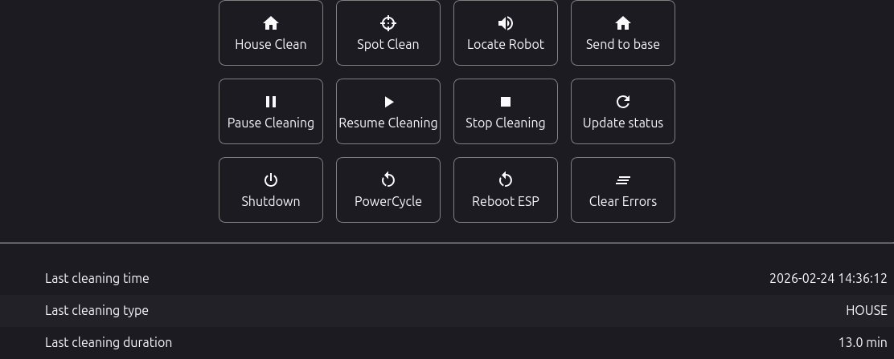
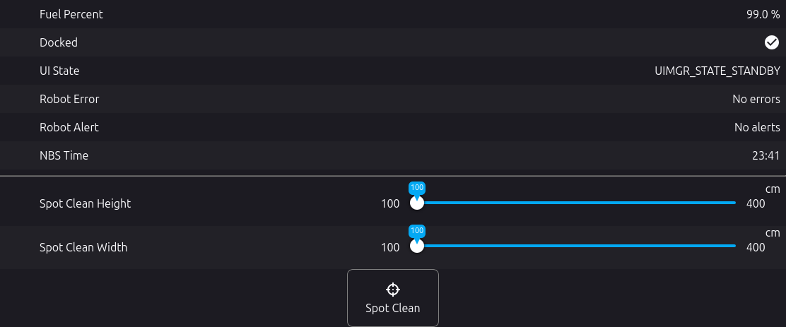
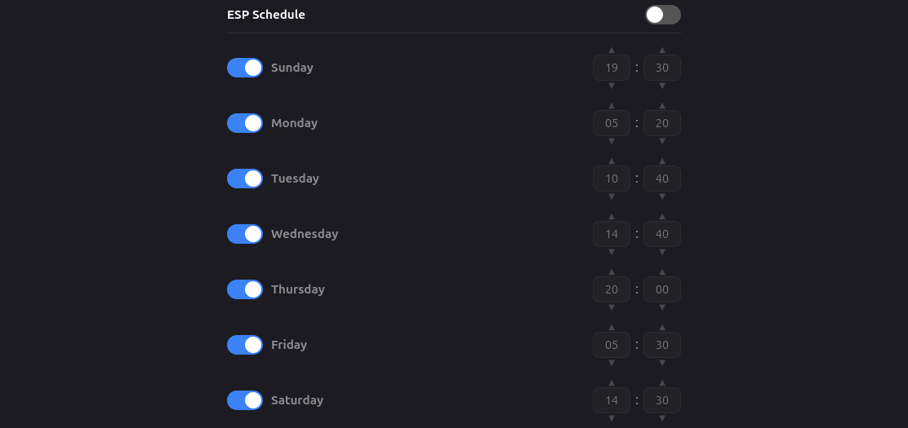
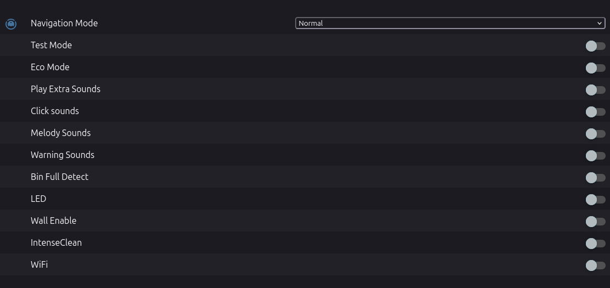
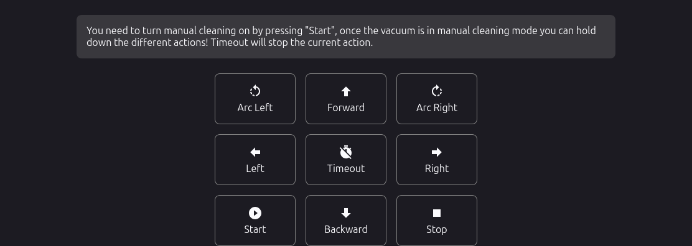
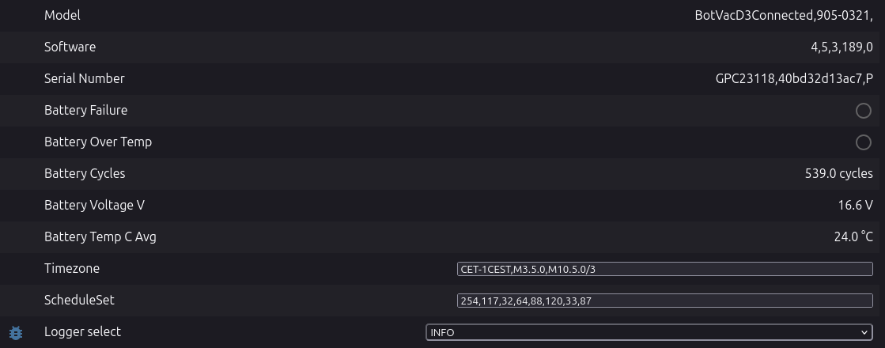
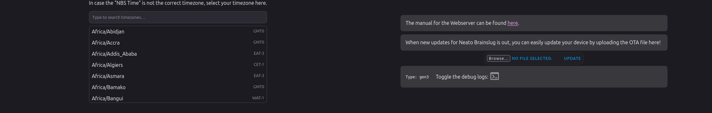
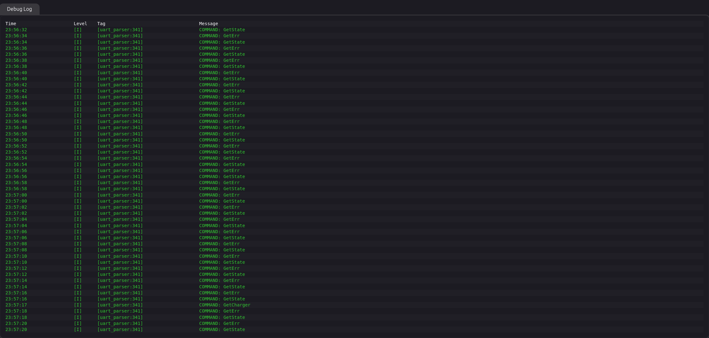

# Robot manual
Some of the features of the robot is detailed here. The pictures here show the webserver, but the same applies to the entities exposed in Home Assistant in case that is used. This document will be expanded upon with time, when more info about the robot is found out!

## Buttons and last cleaning

- Use the different buttons for controlling the robot, some robots may not have all functions availible. 
- `gen2` does not have last cleaning data

## Basic data and spot clean

- Basic status of the robot, battery, docked, erros/alerts and the time by ESP device
- Spot clean a custom area by selecting the size and pressing the spot clean button. `gen2` robots may or may not do this properly

## ESP schedule 

- Schedule starting the robot running on the ESP device, compares to the NBS time

## Robot settings

- These are the settings exposed by the robot, the settings is a little different based on your robot generation, but it's a hit or miss based on what setting does anything or if it applies correctly
- `gen3` robots have the "Navigation Mode" option, while it needs to be verified more an idea based on some observations the different modes could mean. The mode needs to be reselected after each restart of the robot
    - `gentle` - the bot shouldn't push any object that is higher than itself (visible via the lidar).
    - `deep` - the robot will drive into the corners as deep as it can, drive a bit backwards and then clean the corners in a curve. 
- `Intense clean` - reduced the distance between the lanes
- `Wall Enable/Follower` - follows all walls one round and starts cleaning 'senseful' areas. No wall follower will follow the wall for a distance and then start cleaning the area before following the wall for the next area.

## Manual driving

- Only for `gen3` robots, make sure to start manual cleaning before using the buttons.

## Detailed data

- Detailed data about the robot, text fields generated by the timezone selector and schedule as well as the option to change the log level

## Timezone select and ota/info

- If your NBS time is incorrect, select your timezone here, it will update the timezone textfield in the detailed data part
- Upload OTAs, check ESP firmware type (gen2 or gen3) and toggle the debug logs

## Debug logs

- When enabled, you will see this at the bottom of the page, change the log level to get more or less detailed logs. As explained in the [faq](faq.md), seeing `GetState`, `GetErr` and `GetCharger` is normal and happens when the ESP reads the status of the robot.
